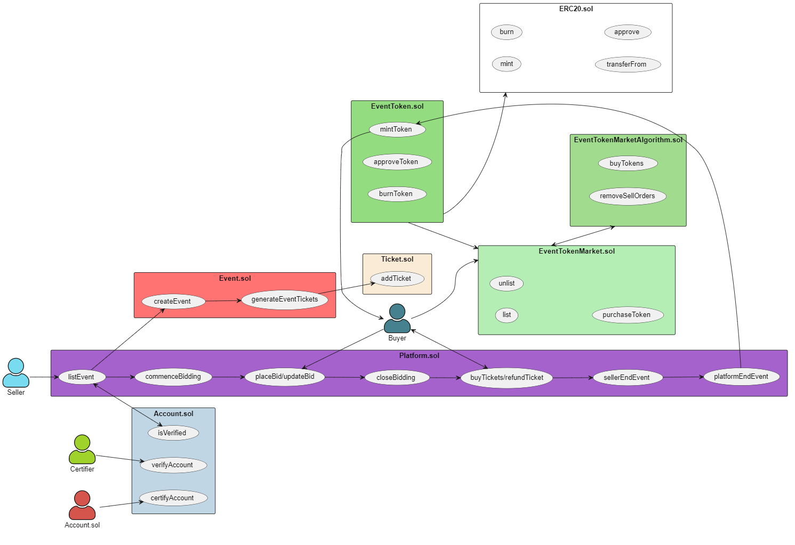

# Architecture & Design document

## Group members:

| Member Name | Admin Number |
| ---|---|
| Han Jun Ding | A0221230E |
| Sean Phang | |
| Tan Teck Hwee | |
| Teo Chin Kai Remus| |
| Teo Phing Huei, Aeron | A0225860E |

## Introduction
The purpose of this project is to leverage on cutting-edge capabilities of blockchain technology to effectively tackle the problem of scalping in the context of popular events. We aim to utilise the blockchain technology to create a secure, transparent, and decentralized system that helps event organizers, ticketing agencies and consumers to effectively manage the sale and distribution of tickets without unfair competition.

## Current challenges

## Contents
* [Architecture](#architecture)
* [Implementation](#implementation) 

## Architecture

Overview of the architecture.

## Implementation

### Ticket sale priority system

#### Listing events
The isOrganiser() modifier ensures that only verified accounts can act as an organiser and list events on the platform. To list an event, the organiser has to specify the venue year, month, day, hour, minute, second, capacity, its address and ticket price details of the event to be held. 

Organiser has to also make a deposit of half the possible ticket sales (capacity * priceOfTicket / 2) to list an event. This is to prevent the organiser from irresponsibly creating and cancelling an event. 

The event details will then be passed to the event contract for the creation of the actual event object. Event tickets will also be generated here and mapped to the newly created eventId.

#### Selling tickets

#### Buying tickets
The buyTickets function is to allow buyers to buy the remaining, available (unsold or refunded) tickets after the bidding session has closed. The following conditions must be met for a buyer to successfully buy tickets to an event:
    1. Event must be a valid and ongoing, with bid state set as “buy”
    2. Buyers can buy a minimum of 1 ticket, and up to a maximum of 4 tickets. This is to prevent scalpers from bulk buying event tickets and reselling at a higher price.
    3. Buyers can only buy tickets if there still are tickets available for sale.
    4. Buyer has sufficient ether to buy the desired amount of tickets

#### Ticket bidding
Commence Bidding
Commence bidding function is to change the event bid state to “open”, allowing buyers to start bidding for the ticket. Only the original organiser is allowed to commence bidding and bid state must be “close” when this function is called, after which bid state will be changed to “open”.

#### Ticket refund

### Accounts Management

#### Seller Validation

### Tokenomics